<div align="center">

<a href="https://ashadabdullah.com">
  <picture>
    <source media="(prefers-color-scheme: dark)" srcset="assets/card-dark.svg">
    <source media="(prefers-color-scheme: light)" srcset="assets/card-light.svg">
    
  </picture>
</a>

[portfolio](https://ashadabdullah.com) · [resume](https://drive.google.com/file/d/1pSu_AaO_lst8opMBwXwxNhCLYrAmEFPc/view) · [linkedin](https://www.linkedin.com/in/ashadqureshi1/) · [x](https://x.com/ashadqu7) · [email](mailto:ashad001sp@gmail.com)

</div>

<details>
<summary><code>$ cat experience.log</code></summary>

```text
2026-now   ImagineArt (Vyro)        Associate Product Manager   Islamabad, PK
2025-2026  Fyltr                    Founder & Lead Developer    Remote
2025-2026  TraderWare / TradersGPT  Senior AI Engineer          Karachi, PK
2024-2025  FireBird Technologies    AI Engineer                 Singapore
2023-2024  RAIN                     Junior AI Engineer          Dallas, TX

2021-2025  BS Computer Science, FAST-NUCES - CGPA 3.78/4.0, Dean's List
```

</details>

<details>
<summary><code>$ ls projects/</code></summary>

```text
claude-arcade   terminal minesweeper wired into Claude Code hooks   rust + ratatui
motif           MCP server that debugs UI from video recordings     gemini 2.5 flash
bolt-sql        schema-aware natural language to SQL engine         rust, spider-eval
superset        personal fork - gutter diffs, usage, auto-update    electron fork
fyltr           AI-native form generation and verification SaaS     next.js, r2
```

[claude-arcade](https://github.com/Ashad001/claude-arcade) · [motif](https://github.com/Ashad001/motif) · [bolt-sql](https://github.com/Ashad001/bolt-sql) · [superset](https://github.com/Ashad001/superset) · [fyltr](https://fyltr-co.vercel.app)

</details>

<details>
<summary><code>$ gh api stats --live</code></summary>

<!-- STATS:START -->
```
$ gh api stats --live
```

```text
public_repos       100
followers          91
total_stars        204
most_starred       remotion-transitions (68 ★)
top_languages      Python · C++ · Jupyter Notebook

contributions_ytd  1630
commits_ytd        99
pull_requests_ytd  1
issues_ytd         2
current_streak     18 days
longest_streak     26 days

last_synced: 2026-08-08 18:33 UTC
```
<!-- STATS:END -->



</details>

<div align="center">

</div>
